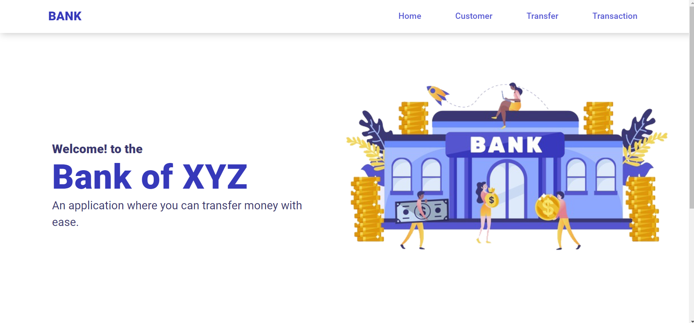
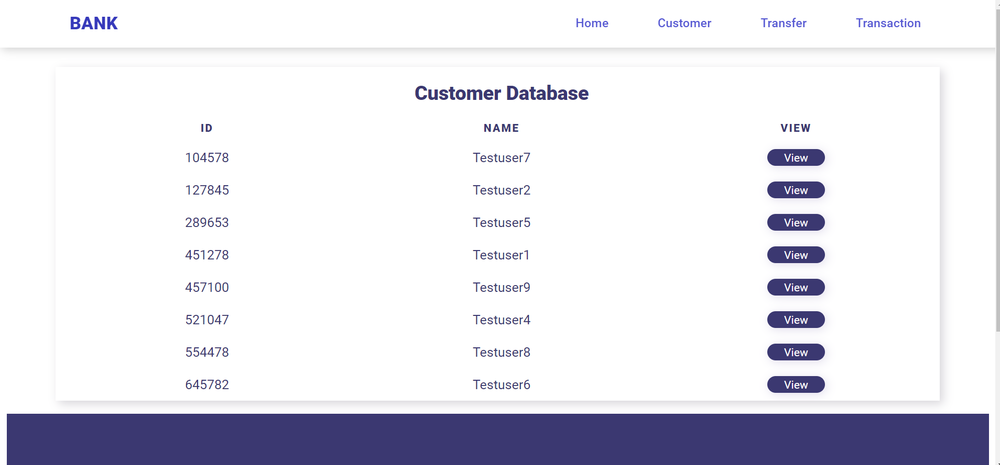
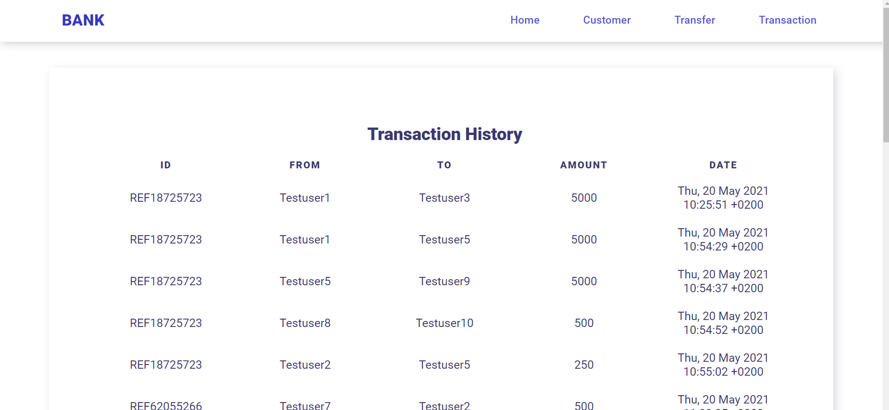
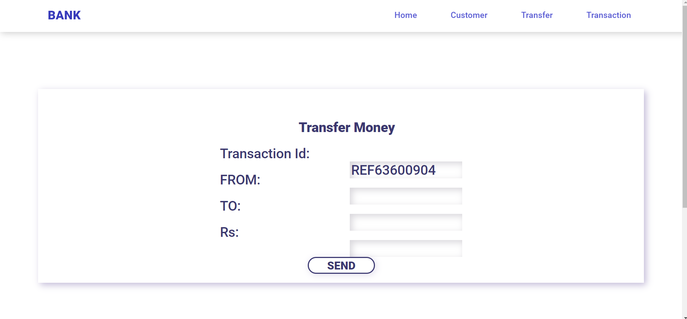

# Dynamic Basic Bank Managment System
## GRIP Internship @TheSparksFoundation
This is an internship task by The Sparks Foundation. 
The website includes following modules:
1. View Customer Database
2. View single customer details
3. View Transaction history
4. Transfer Money

---
FRONTEND : HTML, CSS, JS 
BACKEND : PHP 
DATABASE : MySql 

---
*Aim:* To Create a Transaction system where one can view customer database and tranfer money from one customer to another. Then user can be able to see transaction history of that customer and all the customer.

> Screenshot of Web Pages
## HOME Page

## CSTOMER DATABASE Page

## TRANSACTION HISTORY Page

## TRANSFER Page

